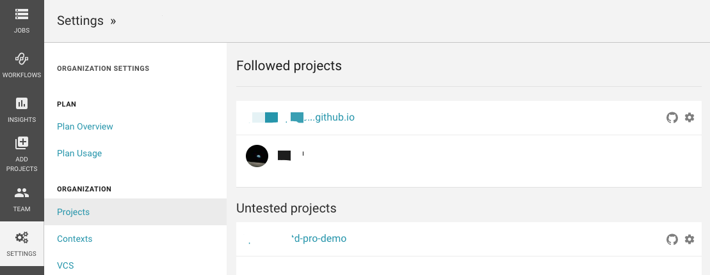
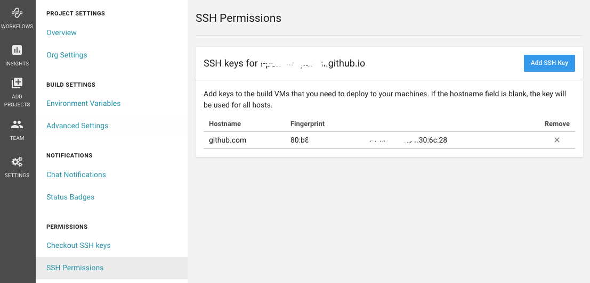
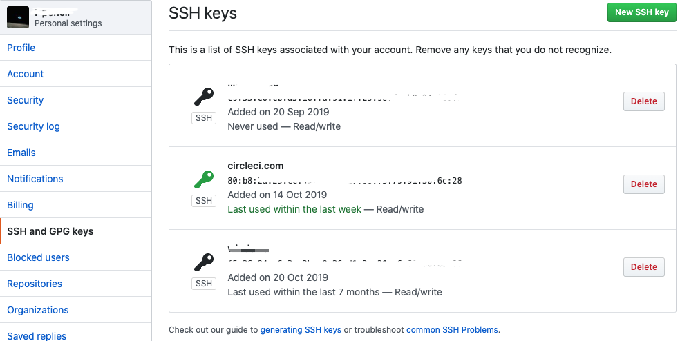

[GitHub](https://github.com/) 能托管软件项目,对个人开发者十分友好，并且它还提供了[GitHub Pages](https://pages.github.com/) 功能，让我们可以搭建我们自己的个人博客网站。

## 关联账户

既然是构建自己的博客网站，就首先有博客仓库，并且将仓库托管到GitHub上。这里是使用[VuePress](https://www.vuepress.cn/)来搭建我们的博客。

然后在[CircleCI](https://circleci.com/)上，用 ***GitHub账号*** 登录CircleCI。登录后，就可以将我们的GitHub仓库和CircleCI起来



## 添加 ssh 密钥

1. 创建密钥

通常我们都是使用 ssh-keygen -t rsa 创建公钥(.pub)和私钥，但是在CircleCI上添加密钥时会报错：


然后官网提供了[方案](https://circleci.com/docs/2.0/add-ssh-key/):

```shell
ssh-keygen -m PEM -t rsa -C "email@example.com"
```

2. 添加密钥

生成了ssh 密钥后，我们需要将密钥添加到CircleCI上，将公钥添加到GitHub上。

GitHub 添加公钥就不说了，这里只说 CircleCI 添加密钥。


> 添加密钥时，Hostname 需要填 github.com

密钥添加完后，就可以看到：



GitHub 添加完后：



可以看到 CircleCI 和GitHub 上 fingerprints 是相同的。

其中，fingerprints 我们是需要添加到构建步骤里的:

```yml
steps:
  - add_ssh_keys:
      fingerprints:
        - "80:b8:2a:XX:XX:XX:XX:XX:6c:28"
```

## 遇到的问题

1. The authenticity of host 'github.com' can't be established


