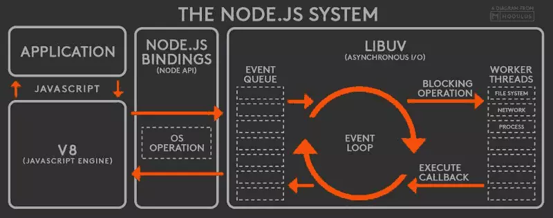
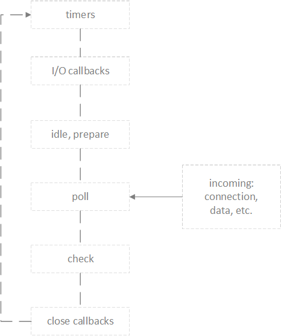
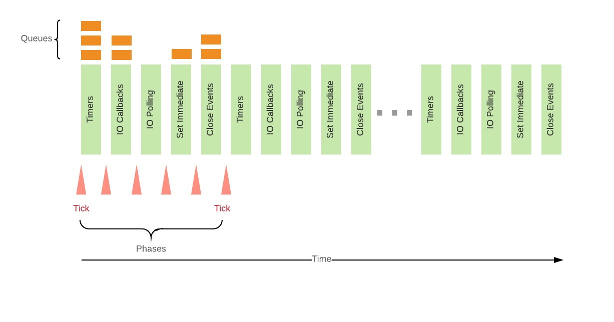

注意区分：

- ` nodejs `的` event `是基于` libuv `，而浏览器的` event loop `则在[` html5 `的规范](https://www.w3.org/TR/html5/webappapis.html#event-loops)中明确定义
- ` libuv `已经对` event loop `作出了实现，而` html5 `规范中只是定义了浏览器中` event loop `的模型，具体实现留给了浏览器厂商。

## ` NodeJS `中的` event loop `

关于` nodejs `中的` event loop `有两个地方可以参考，一个是` nodejs `[官方的文档](https://nodejs.org/en/docs/guides/event-loop-timers-and-nexttick/)；另一个是` libuv `的[官方的文档](http://docs.libuv.org/en/v1.x/design.html)，前者已经对` nodejs `有一个比较完整的描述，而后者则有更多细节的描述。

看图：



- 首先我们能看到我们的` js `代码（` APPLICATION `）会先进入` v8 `引擎,` v8 `引擎中主要是一些` setTimeout `之类的方法。
- 其次如果我们的代码中执行了` nodeApi `，比如` require('fs').read() `，` node `就会交给` libuv `库处理，这个` libuv `库是别人写的，他就是` node `的事件环。
- ` libuv`库是通过单线程异步的方式来处理事件，我们可以看到` work threads `是个多线程的队列，通过外面` event loop `阻塞的方式来进行异步调用。
- 等到` work threads `队列中有执行完成的事件，就会通过` EXECUTE CALLBACK `回调给` EVENT QUEUE `队列，把它放入队列中。
- 最后通过事件驱动的方式，取出` EVENT QUEUE `队列的事件，交给我们的应用

## 一、` nodeJS `的` Event Loop `阶段

当` Node.js `启动时，会做这几件事：
1. 初始化` event loop `
2. 开始执行脚本（或者进入` REPL `）。这些脚本有可能会调用一些异步` API `、设定定时器或者调用` process.nextTick() `
3. 开始处理` event loop `

处理` event loop `的过程如图所示：



图中每个方框都是` event loop `中的一个阶段。

每个阶段都有一个先入先出队列，这个队列存有要执行的回调函数地址。不过每个阶段都有其特有的使命。一般来说，当` event loop ` 达到某个阶段时，会在这个阶段进行一些特殊的操作，然后执行这个阶段的队列里的所有回调。 下列两种情况之一会停止止执行这些回调：

- 队列的操作全被执行完了
- 执行的回调数目到达指定的最大值 然后，` event loop ` 进入下一个阶段，然后再下一个阶段

一方面，上面这些操作都有可能添加计时器；另一方面，操作系统会向` poll `队列中添加新的事件，当` poll ` 队列中的事件被处理时可能会有新的` poll `事件进入` poll ` 队列。结果，耗时较长的回调函数可以让` event loop `在` poll ` 阶段停留很久，久到错过了计时器的触发时机。

注意，` Windows `的实现和` Unix/Linux ` 的实现稍有不同，不过对本文内容影响不大。本文囊括了` event loop `最重要的部分，不同平台可能有七个或八个阶段，但是上面的几个阶段是我们真正关心的阶段，而且是` Node.js ` 真正用到的阶段。

## 二、各阶段概览

- ` timers `阶段：这个阶段执行` setTimeout `和 `setInterval `的回调函数。
- ` I/O callbacks `阶段：不在` timers `阶段、` close callbacks `阶段和` check ` 阶段这三个阶段执行的回调，都由此阶段负责，这几乎包含了所有回调函数。
- ` idle `, ` prepare `阶段：` event loop `内部使用的阶段。
- ` poll `阶段：获取新的` I/O `事件。在某些场景下` Node.js ` 会阻塞在这个阶段。
- ` check `阶段：执行` setImmediate() `的回调函数。
- ` close callbacks `阶段：执行关闭事件的回调函数，如` socket.on('close', fn) `里的` fn `。

一个` Node.js `程序结束时，` Node.js `会检查` event loop ` 是否在等待异步` I/O ` 操作结束，是否在等待计时器触发，如果没有，就会关掉` event loop `。

## 三、各阶段详解

### 3.1 ` timers `阶段

计时器指定多久以后可以执行某个回调函数。当指定的时间达到后，计时器的回调函数会尽早被执行。如果操作系统很忙，或者` Node.js  `正在执行一个耗时的函数，那么计时器的回调函数就会被推迟执行。

注意，从原理上来说，` poll ` 阶段能控制计时器的回调函数什么时候被执行。

举例来说，你设置了一个计时器在` 100 ` 毫秒后执行，然后你的脚本用了` 95 `毫秒来异步读取了一个文件：

```js
const fs = require('fs');

function someAsyncOperation(callback) {
  // 假设读取这个文件一共花费 95 毫秒
  fs.readFile('/path/to/file', callback);
}

const timeoutScheduled = Date.now();

setTimeout(() => {
  const delay = Date.now() - timeoutScheduled;

  console.log(`${delay}毫秒后执行了 setTimeout 的回调`);
}, 100);


// 执行一个耗时 95 毫秒的异步操作
someAsyncOperation(() => {
  const startCallback = Date.now();

  // 执行一个耗时 10 毫秒的同步操作
  while (Date.now() - startCallback < 10) {
    // 什么也不做
  }
});

```

当` event loop `进入` poll `阶段，发现` poll ` 队列为空（因为文件还没读完），` event loop ` 检查了一下最近的计时器，大概还有` 100 `毫秒时间，于是` event loop `决定这段时间就停在` poll `阶段。在` poll `阶段停了` 95  `毫秒之后，` fs.readFile `操作完成，一个耗时` 10 ` 毫秒的回调函数被系统放入` poll `队列，于是` event loop ` 执行了这个回调函数。执行完毕后，` poll `队列为空，于是` event loop `去看了一眼最近的计时器, ` event loop `发现，已经超时` 95 + 10 - 100 = 5 `毫秒了，于是经由` check `阶段、` close callbacks `阶段绕回到` timers `阶段，执行` timers ` 队列里的那个回调函数。这个例子中，` 100 ` 毫秒的计时器实际上是在` 105 `毫秒后才执行的。

注意：为了防止` poll `阶段占用了` event loop ` 的所有时间，` libuv `（` Node.js `用来实现` event loop `和所有异步行为的` C  `语言写成的库）对`  poll ` 阶段的最长停留时间做出了限制，具体时间因操作系统而异。

### 3.2 ` I/O callbacks `阶段

这个阶段会执行一些系统操作的回调函数，比如` TCP ` 报错，如果一个` TCP socket `开始连接时出现了` ECONNREFUSED ` 错误，一些` *nix `系统就会（向 ` Node.js `）通知这个错误。这个通知就会被放入` I/O callbacks `队列。

### 3.3 ` poll `阶段（轮询阶段）

` poll `阶段有两个功能：

1. 如果发现计时器的时间到了，就绕回到` timers ` 阶段执行计时器的回调。
2. 然后再，执行` poll `队列里的回调。

当` event loop `进入` poll `阶段，如果发现没有计时器，就会：

1. 如果` poll `队列不是空的，` event loop ` 就会依次执行队列里的回调函数，直到队列被清空或者到达` poll ` 阶段的时间上限。
2. 如果` poll `队列是空的，就会：
 - 如果有` setImmediate() `任务，` event loop `就结束` poll ` 阶段去往` check `阶段。
 - 如果没有` setImmediate() `任务，` event loop ` 就会等待新的回调函数进入`  poll `队列，并立即执行它。

一旦` poll `队列为空，` event loop ` 就会检查计时器有没有到期，如果有计时器到期了，` event loop ` 就会回到` timers `阶段执行计时器的回调。

### 3.4 ` check `阶段

这个阶段允许开发者在` poll `阶段结束后立即执行一些函数。如果 ` poll `阶段空闲了，同时存在` setImmediate() `任务，` event loop `就会进入` check `阶段。

` setImmediate() ` 实际上是一种特殊的计时器，有自己特有的阶段。它是通过` libuv ` 里一个能将回调安排在` poll `阶段之后执行的` API `实现的。

一般来说，当代码执行后，` event loop `最终会达到` poll ` 阶段，等待新的连接、新的请求等。但是如果一个回调是由 ` setImmediate() `发出的，同时` poll `阶段空闲下来了，` event loop `就会结束` poll `阶段进入` check `阶段，不再等待新的` poll `事件。

### 3.5 ` close callbacks `阶段

如果一个` socket `或者` handle `被突然关闭（比如 ` socket.destroy() `），那么就会有一个` close ` 事件进入这个阶段。否则，这个` close `事件就会经过 ` process.nextTick() `触发。

## 微任务和宏任务

每次执行栈的同步任务执行完毕，就会去任务队列中取出完成的异步任务，队列中又分为` microtasks queues `务队列等到把` microtasks  queues `所有的` microtasks `都执行完毕,注意是所有的,他才会从宏任务队列中取事件。等到把队列中的事件取出一个，放入执行栈执行完成，就算一次循环结束，之后` event loop `继续循环，他会再去` microtasks queues `执行所有的任务，然后再从宏任务队列里面取一个，如此反复循环。

- 同步任务执行完
- 去执行` microtasks`，把所有` microtasks queues `清空
- 取出一个` macrotasks queues `的完成事件，在执行栈执行
- 再去执行` microtasks `
- ` ... `
- ` ... `
- ` ... `

### ` macrotasks `与` microtasks `的区别

- ` macrotasks `: ` setTimeout`、` setInterval ` 、` setImmediate `、 ` I/O `、` UI `渲染
- ` microtasks `: ` Promise `、 ` process.nextTick `、` Object.observe `、 ` MutationObserver`。

在[` Promise/A+ `的规范](https://promisesaplus.com/#notes)中，` Promise `的实现可以是微任务，也可以是宏任务，但是普遍的共识表示(至少` Chrome `是这么做的)，` Promise ` 应该是属于微任务阵营的

看图：



绿色小块是` macrotask `（宏任务），` macrotask ` 中间的粉红箭头是` microtask `（微任务）。

举个例子：

```js
setTimeout(()=>{
    console.log('A');
},0);
var obj={
    func:function () {
        setTimeout(function () {
            console.log('B')
        },0);
        return new Promise(function (resolve) {
            console.log('C');
            resolve();
        })
    }
};
obj.func().then(function () {
    console.log('D')
});
console.log('E');
```

1. 首先` setTimeout A `被加入到事件队列中` ==> ` 此时` macrotasks `中有` [‘A’] `；
2. ` obj.func() `执行时，` setTimeout B ` 被加入到事件队列中` ==> ` 此时` macrotasks `中有` [‘A’，‘B’] `；
3. 接着` return`一个` Promise `对象，` Promise ` 新建后立即执行 执行` console.log('C')`; 控制台首次打印` ‘C’ `;
4. 然后，`then `方法指定的回调函数，被加入到` microtasks `当前脚本所有同步任务执行完才会执行。 ` ==>  ` 此时` microtasks `中有` [‘D’] `；
5. 然后继续执行当前脚本的同步任务，故控制台第二次输出` ‘E’ `；
6. 此时所有同步任务执行完毕，如上所述先检查` microtasks `其中所有任务，故控制台第三次输出` ‘D’ `；
7. 最后再执行` macrotask `的任务，并且按照入队列的时间顺序，控制台第四次输出` ‘A’ `，控制台第五次输出` ‘B’ `。


## 四、` setImmediate() vs setTimeout() `

` setImmediate `和` setTimeout ` 很相似，但是其回调函数的调用时机却不一样。

` setImmediate() `的作用是在当前` poll ` 阶段结束后调用一个函数。 ` setTimeout() ` 的作用是在一段时间后调用一个函数。 这两者的回调的执行顺序取决于` setTimeout `和` setImmediate ` 被调用时的环境。

举例来说，如果在主模块中运行下面的脚本，那么两个回调的执行顺序是无法判断的：

```js
setTimeout(() => {
  console.log('timeout');
}, 0);

setImmediate(() => {
  console.log('immediate');
});
```
运行结果如下：
```script
$ node timeout_vs_immediate.js
timeout
immediate

$ node timeout_vs_immediate.js
immediate
timeout
```

` setTimeout/setInterval `的第二个参数取值范围是：` [1, 2^31 - 1] `，如果超过这个范围则会初始化为` 1 `，即` setTimeout(fn, 0) === setTimeout(fn, 1) `。我们知道` setTimeout `的回调函数在` timer `阶段执行，` setImmediate `的回调函数在 ` check `阶段执行，` event loop `的开始会先检查` timer ` 阶段，但是在开始之前到` timer ` 阶段会消耗一定时间，所以就会出现两种情况：

1. ` timer `前的准备时间超过` 1ms `，满足`  loop->time >= 1 `，则执行` timer `阶段（` setTimeout `）的回调函数
2. ` timer `前的准备时间小于` 1ms `，则先执行` check ` 阶段（` setImmediate `）的回调函数，下一次` event loop `执行 ` timer `阶段（` setTimeout `）的回调函数

但是，如果把上面代码放到` I/O `操作的回调里，` setImmediate   `的回调就总是优先于` setTimeout `的回调：

```js
// timeout_vs_immediate.js
const fs = require('fs');

fs.readFile(__filename, () => {
  setTimeout(() => {
    console.log('timeout');
  }, 0);
  setImmediate(() => {
    console.log('immediate');
  });
});

```
运行结果如下：

```script
$ node timeout_vs_immediate.js
immediate
timeout
```

` fs.readFile `的回调函数执行完后：

1. 注册` setTimeout `的回调函数到` timer `阶段
2. 注册` setImmediate `的回调函数到` check `
3. `event loop `从` pool `阶段出来继续往下一个阶段执行，恰好是` check `阶段，所以`  setImmediate `的回调函数先执行
4. 本次` event loop `结束后，进入下一次` event loop `，执行 ` setTimeout `的回调函数

所以，在` I/O Callbacks `中注册的` setTimeout `和` setImmediate `，永远都是` setImmediate `先执行。

## 五、` process.nextTick() `

在任何一个阶段调用` process.nextTick `(回调)，回调都会在当前阶段继续运行前被调用。这种行为有的时候会造成不好的结果，因为可以递归地调用` process.nextTick() `，这样` event loop ` 就会一直停在当前阶段不走,无法进入` poll `阶段。

比如如下代码：

```js
setInterval(() => {
  console.log('setInterval')
}, 100)

process.nextTick(function tick () {
  process.nextTick(tick)
})
```
运行结果：` setInterval `永远不会打印出来。

` process.nextTick `会无限循环,使` event  loop `停留在当前阶段，无法进入` timers `阶段。

解决方法通常是用` setImmediate `替代` process.nextTick `，如下：

```js
setInterval(() => {
  console.log('setInterval')
}, 100)

setImmediate(function immediate () {
  setImmediate(immediate)
})
```
` setImmediate `内执行` setImmediate `会将` immediate `函数注册到下一次` event loop `的` check `阶段，而不是当前正在执行的` check `阶段，所以给了` event loop `上其他阶段执行的机会。

## 六、` process.nextTick() vs setImmediate() `

` process.nextTick() `的回调会在当前` event loop `阶段「立即」执行。 ` setImmediate() `的回调会在后续的` event loop ` 周期（` tick `）执行。

推荐开发者在任何情况下都使用` setImmediate() `，因为它的兼容性更好，而且它更容易理解。

## 七、什么时候用` process.nextTick() `

使用的理由有两个：

1. 让开发者处理错误、清除无用的资源，或者在` event loop `当前阶段结束前尝试重新请求资源
2. 有时候有必要让一个回调在调用栈` unwind `之后，` event loop `进入下阶段之前执行

为了让代码更合理，我们可能会写这样的代码：

```js
const server = net.createServer();
server.on('connection', (conn) => { });

server.listen(8080);
server.on('listening', () => { });
```

假设` listen() `在` event loop `一启动的时候就执行了，而` listening `事件的回调被放在了` setImmediate() `里，` listen ` 动作是立即发生的，如果想要` event loop `执行` listening `回调，就必须先经过` poll `阶段，当时` poll ` 阶段有可能会停留，以等待连接，这样一来就有可能出现` connect `事件的回调比` listening `事件的回调先执行。这显然不合理，所以我们需要用 ` process.nextTick `

再举一个例子，一个类继承了` EventEmitter `，而且想在实例化的时候触发一个事件：

```js
const EventEmitter = require('events');
const util = require('util');

function MyEmitter() {
  EventEmitter.call(this);
  this.emit('event');
}
util.inherits(MyEmitter, EventEmitter);

const myEmitter = new MyEmitter();
myEmitter.on('event', () => {
  console.log('an event occurred!');
});

```

不能直接在构造函数里执行` this.emit('event') `，因为这样的话后面的回调就永远无法执行。把` this.emit('event') `放在` process.nextTick() `里，后面的回调就可以执行，这才是我们预期的行为：

```js
const EventEmitter = require('events');
const util = require('util');

function MyEmitter() {
  EventEmitter.call(this);

  // use nextTick to emit the event once a handler is assigned
  process.nextTick(() => {
    this.emit('event');
  });
}
util.inherits(MyEmitter, EventEmitter);

const myEmitter = new MyEmitter();
myEmitter.on('event', () => {
  console.log('an event occurred!');
});
```

## 参考文献：

[Event Loop、计时器、nextTick](https://juejin.im/post/5ab7677f6fb9a028d56711d0)

原文： [https://nodejs.org/en/docs/guides/event-loop-timers-and-nexttick/](https://nodejs.org/en/docs/guides/event-loop-timers-and-nexttick/)

[Event Loop 必知必会（六道题）](https://zhuanlan.zhihu.com/p/34182184)

[node基础面试事件环？微任务、宏任务？一篇带你飞](https://juejin.im/post/5b35cdfa51882574c020d685)

[微任务、宏任务与Event-Loop](https://juejin.im/post/5b73d7a6518825610072b42b)

<!-- [笔试题——JavaScript事件循环机制（event loop、macrotask、microtask）](https://juejin.im/post/5bac87b6f265da0a906f78d8) -->
