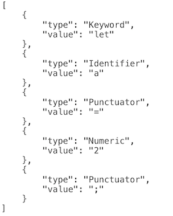
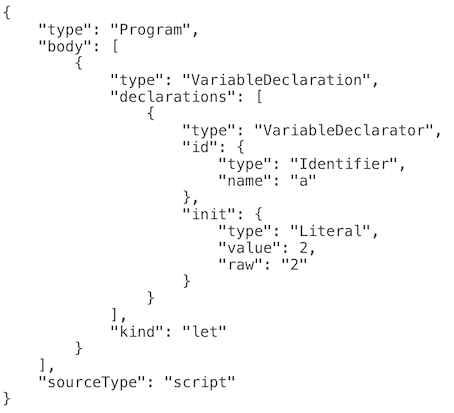
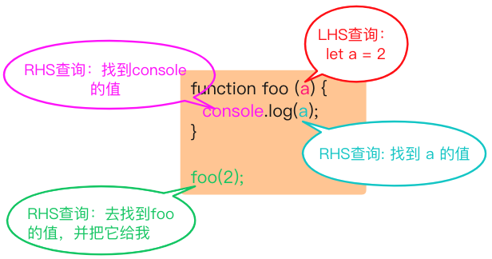
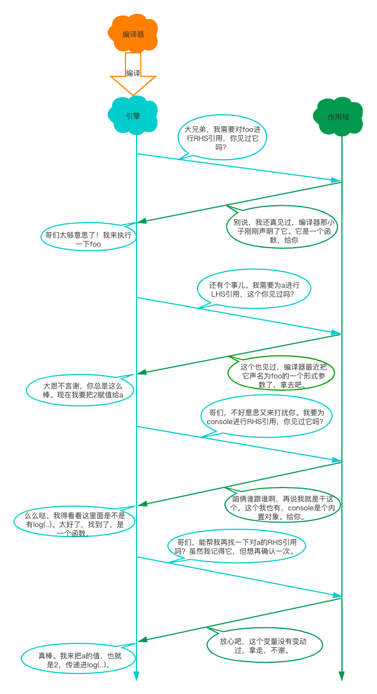
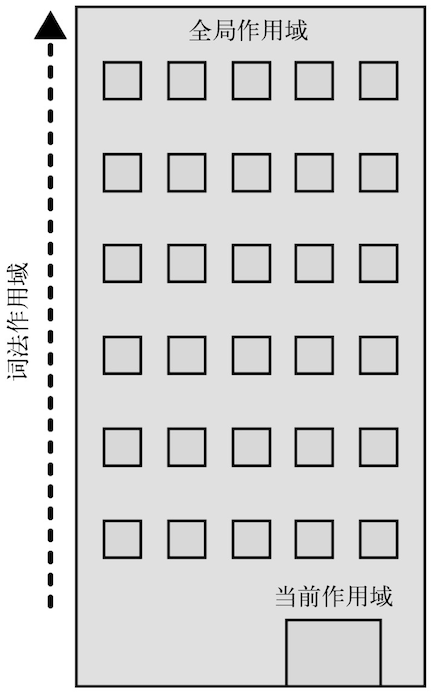
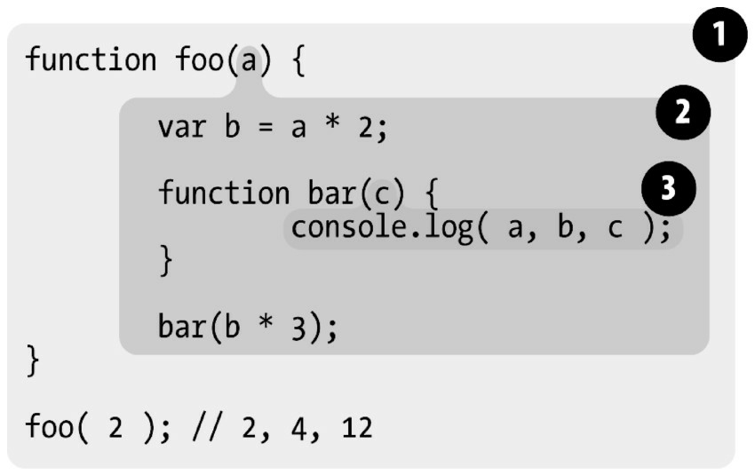

## 作用域是什么

***对变量进行存储、访问和修改，几乎是所有编程语言最基本的功能之一。正是这种存储和访问变量值的能力将` 状态 `带给了程序。***

通过变量来保存和定义当前程序状态，通过状态，程序可以完成一些复杂的逻辑判断和任务。如果没有了状态这个概念，程序虽然也能执行一些简单的任务，但它会受到高度限制，做不到非常有趣。

但是将变量引入程序会引起几个很有意思的问题：这些变量存储在哪？程序需要时如何找到他们？

这些问题说明需要一套设计良好的规则来存储变量，并且之后可以很方便地找到这些变量。这套规则被称为**作用域**

### 1.1 编译原理

尽管通常将 JavaScript 归类为 "动态"或 "解释执行"语言，但事实上它是一门编译语言。但与传统的编译语言不通，它不是提前编译的，编译结果也不能在分布式系统中进行移植。

在传统编译语言的流程中，程序中的一段源代码在执行之前会经历三个步骤，统称为 "编译"：

- 分词/词法分析(Tokenizing/Lexing)
- 解析/语法分析(Parsing)
- 代码生成

#### 1.1.1 分词/词法分析

这个过程会将由字符组成的字符串分解成词法单元(token: 对编程语言来说有意义的代码)。

例如 var a = 2; 这条语句通常会被分解成下面这些词法单元：



空格是否会被当做词法单元，取决于空格在这门语言中是否具有意义。

> 分词(tokenizing)和词法分析(Lexing)之间的区别是非常微妙、晦涩的，主要差异在于词法单元的识别是通过` 有状态 `还是` 无状态 `的方式进行的。
>
> 简单来说，如果词法单元生成器在判断a是一个独立的词法单元还是其他词法单元的一部分时，调用的是有状态的解析规则，那么这个过程被称为` 词法分析 `

#### 1.1.2 解析/语法分析

这个过程是将词法单元流(数组)转换成一个由元素逐渐嵌套所组成的代表了程序语法结构的树。这个树被称为 “抽象语法树” (Abstract Syntax Tree，AST)。

var a = 2; 的抽象语法树如下：



#### 1.1.3 代码生成

将AST转换成可执行的过程称为` 代码生成 `。这个过程与语言、目标平台等息息相关。

对于JavaScript来说，大部分情况下编译发生在代码执行前的几微秒(甚至更短)的时间内。所以，JavaScript 引擎不会有大量的(像其他语言编译器那么多的)时间用来进行优化。

### 1.2 理解作用域

我们学习作用域的方式是将这个过程模拟成几个人物之间的对话。那么，有哪些人物呢？

#### 1.2.1 演员表

在场景 var a = 2; 中，我们有这些演员：

- 引擎

从头到尾负责整个JavaScript程序的编译及执行过程。

- 编译器

殷勤的好朋友之一，负责语法分析及代码生成等脏活累活。

- 作用域

引擎的另一位好朋友，负责收集并维护由所有声明的标识符(变量)组成的一系列查询，并实施一套非常严格的规则，确定当前执行的代码对这些标识符的访问权限。

#### 1.2.2 对话

当看见 var a = 2; 这段程序时，引擎会认为这里有两个完全不同的声明，一个由编译器在编译时处理，另一个则由引擎在运行时处理。

下面我们来看看他们是如何协调工作的。

 编译器首先会将这段程序分解成词法单元，然后将词法单元解析成一个树结构。但是当编译器开始进行代码生成时，它对这段程序的处理方式会和预期的有所不同。

 编译器会进行如下处理:

 1. 遇到 var a，编译器会询问作用域是否已经有一个该名称的变量存在于同一个作用域的集合中。如果是，**编译器会忽略该声明**，继续进行编译，否则它会要求作用域在当前作用域的集合中声明一个新的变量，并且命名为 a。

 2. 接下来编译器会为引擎生成运行时所需的代码，这些代码被用来处理 a = 2 这个赋值操作。引擎运行时会首先询问作用域，在当前的作用域集合中是否存在一个叫做 a 的变量。如果是，引擎就会使用这个变量；如果否，引擎会继续查找该变量。

如果引擎最终找到了 a 变量，就会将2赋值给它。否则引擎就会抛出一个异常。

总结：变量的赋值操作会执行两个动作，首先编译器会在当前作用域中声明一个变量(如果之前没有声明过)，然后在运行时引擎会在作用域中查找该变量，如果能够找到就会对它赋值。

查找的过程由作用域进行协助，但是引擎执行怎样的查找，会影响最终的查找结果。

查找的类型有两种：

- **LHS查询**
- **RHS查询**

当变量出现在赋值操作的左侧时进行LHS查询，出现在右侧时进行RHS查询。

在本例中，引擎为变量 a 进行 LHS 查询。

讲得更准确一点，RHS 查询与简单地查找某个变量的值别无二致，而LHS查询则是试图找到变量的容器本身，从而可以对其赋值。

> LHS 和 RHS 的含义是“赋值操作的左侧或右侧”并不一定意味着就是“=赋值操作符的左侧或右侧”。赋值操作还有其他几种形式，因此在概念上最好将其理解成“**赋值操作的目标是谁(LHS)**”以及“**谁是赋值操作的源头(RHS)**”。

例子：

```js
function foo (a) {
  console.log(a);
}
foo (2);
```

最后一行foo (..)函数的调用需要对foo进行RHS引用，意味着“去找到foo的值，并把它给我”。并且(..)意味着foo的值需要被执行，因此它最好真的是一个函数类型的值！

这里还有一个容易被忽略却非常重要的细节。

代码中隐式的a=2操作可能很容易被你忽略掉。这个操作发生在2被当作参数传递给foo(..)函数时，2会被分配给参数a。为了给参数a（隐式地）分配值，需要进行一次LHS查询。

这里还有对a进行的RHS引用，并且将得到的值传给了console.log(..)。console. log(..)本身也需要一个引用才能执行，因此会对console对象进行RHS查询，并且检查得到的值中是否有一个叫作log的方法。

最后，在概念上可以理解为在LHS和RHS之间通过对值2进行交互来将其传递进log(..)（通过变量a的RHS查询）。假设在log(..)函数的原生实现中它可以接受参数，在将2赋值给其中第一个（也许叫作arg1）参数之前，这个参数需要进行LHS引用查询



你可能会倾向于将函数声明function foo(a) {..．概念化为普通的变量声明和赋值，比如var foo、foo = function(a) {...。如果这样理解的话，这个函数声明将需要进行LHS查询。

> **然而还有一个重要的细微差别，编译器可以在代码生成的同时处理声明和值的定义，比如在引擎执行代码时，并不会有线程专门用来将一个函数值“分配给”foo。因此，将函数声明理解成前面讨论的LHS查询和赋值的形式并不合适。**

让我们把上面这段代码的处理过程想象成一段对话，这段对话可能是下面这样的。



### 1.3 作用域嵌套

作用域是根据名称查找变量的一套规则。

当一个块或函数嵌套在另一个块或函数中时，就发生了作用域的嵌套。因此，在当前作用域中无法找到某个变量时，引擎就会在外层嵌套的作用域中继续查找，直到找到该变量，或抵达最外层的作用域（也就是全局作用域）为止。


遍历嵌套作用域链的规则很简单：引擎从当前的执行作用域开始查找变量，如果找不到，就向上一级继续查找。当抵达最外层的全局作用域时，无论找到还是没找到，查找过程都会停止。

把作用域链比喻成一个建筑，就好像是下图：



这个建筑代表程序中的嵌套作用域链。第一层楼代表当前的执行作用域，也就是你所处的位置。建筑的顶层代表全局作用域。

### 1.4 异常

为什么区分LHS和RHS是一件重要的事情？

因为在变量还没有声明（在任何作用域中都无法找到该变量）的情况下，这两种查询的行为是不一样的。

如下代码：

```js
function foo(a) {
  console.log(a + b);
  b = a;
}

foo(2)
```

第一次对b进行RHS查询时是无法找到该变量的。也就是说，这是一个“未声明”的变量，因为在任何相关的作用域中都无法找到它。如果RHS查询在所有嵌套的作用域中遍寻不到所需的变量，引擎就会抛出ReferenceError异常。

在非“严格模式”下，当引擎执行LHS查询时，如果在顶层（全局作用域）中也无法找到目标变量，全局作用域中就会创建一个具有该名称的变量，并将其返还给引擎。

在严格模式下。同正常模式，或者说宽松/懒惰模式相比，严格模式在行为上有很多不同。**其中一个不同的行为是严格模式禁止自动或隐式地创建全局变量**。因此，在严格模式中LHS查询失败时，并不会创建并返回一个全局变量，引擎会抛出同RHS查询失败时类似的ReferenceError异常。

接下来，如果RHS查询找到了一个变量，但是你尝试对这个变量的值进行不合理的操作，比如试图对一个非函数类型的值进行函数调用，或者引用null或undefined类型的值中的属性，那么引擎会抛出另外一种类型的异常，叫作TypeError。

**ReferenceError同作用域判别失败相关，而TypeError则代表作用域判别成功了，但是对结果的操作是非法或不合理的。**

## 词法作用域

作用域共有两种主要的工作模型：
- 词法作用域
- 动态作用域

JavaScript 采用的是词法作用域模型。

### 2.1 词法阶段

大部分标准语言编译器的第一个工作阶段叫作词法化（也叫单词化）。词法化的过程会对源代码中的字符进行检查，如果是有状态的解析过程，还会赋予单词语义。

**简单地说，词法作用域就是定义在词法阶段的作用域。换句话说，词法作用域是由你在写代码时将变量和块作用域写在哪里来决定的，因此当词法分析器处理代码时会保持作用域不变（大部分情况下是这样的）。**

如下代码：

```js
function foo(a) {
  var b = a * 2;
  function bar(c) {
    console.log(a, b, c);
  }
  bar(b * 3)
}

foo(2)
```

在这个例子中有三个逐级嵌套的作用域,可以将它们想象成几个逐级包含的气泡。



❶ 包含着整个全局作用域，其中只有一个标识符：foo。

❷ 包含着foo所创建的作用域，其中有三个标识符：a、bar 和 b。

❸ 包含着bar所创建的作用域，其中只有一个标识符：c。

作用域气泡由其对应的作用域块代码写在哪里决定，它们是逐级包含的。

没有任何函数的气泡可以（部分地）同时出现在两个外部作用域的气泡中，就如同没有任何函数可以部分地同时出现在两个父级函数中一样。

### 2.2 欺骗词法

如果词法作用域完全由写代码期间函数所声明的位置来定义，怎样才能在运行时来“修改”（也可以说欺骗）词法作用域呢？

JavaScript中有两种机制来实现这个目的。

#### 2.2.1 eval

JavaScript中的eval(..)函数可以接受一个字符串为参数。

思考一下，下面的代码打印出来的是什么：

```js
function foo(str, a) {
  eval(str);
  console.log(a, b);
}

var b = 2;
foo('var b = 3;', 1);
```

上面的代码输出的不是1，2，而是输出的是1，3。

这是因为在JavaScript中，**eval的参数会好像就是书写在程序中这个位置的代码**

在执行eval(..)之后的代码时，引擎并不“知道”或“在意”前面的代码是以动态形式插入进来，并对词法作用域的环境进行修改的。引擎只会如往常地进行词法作用域查找。

上面的代码中，eval(...)的参数"var b = 3;"会被当做本来就在那里一样来处理。也就是说在当前作用域(foo)中，声明了一个新的变量b，并遮蔽了外部（全局）作用域中的同名变量。

因此它对已经存在的foo(..)的词法作用域进行了修改。

当console.log(..)被执行时，会在foo(..)的内部同时找到a和b，但是永远也无法找到外部的b。因此会输出“1, 3”而不是正常情况下会输出的“1, 2”。

也就是说，**eval是如何通过代码(eval 的参数)来欺骗和假装成书写时（也就是词法期）代码就在那，以实现修改词法作用域环境的。**

eval(..)通常被用来执行动态创建的代码。

> 默认情况下，如果eval(..)中所执行的代码包含有一个或多个声明（无论是变量还是函数），就会对eval(..)所处的词法作用域进行修改。

> **在严格模式的程序中，eval(..)在运行时有其自己的词法作用域，意味着其中的声明无法修改所在的作用域。**

```js
function foo(str) {
  "use strict";
  eval(str);
  console.log(a); // ReferenceError: a is not defined
}
foo("var a = 2");
```

JavaScript中还有其他一些功能效果和eval(..)很相似。setTimeout(..)和setInterval(..)的第一个参数可以是字符串，字符串的内容可以被解释为一段动态生成的函数代码。这些功能已经过时且并不被提倡。不要使用它们！

new Function(..)函数的行为也很类似，最后一个参数可以接受代码字符串，并将其转化为动态生成的函数（前面的参数是这个新生成的函数的形参）。这种构建函数的语法比eval(..)略微安全一些，但也要尽量避免使用。

#### 2.2.2 with

JavaScript中另一个难以掌握（并且现在也不推荐使用）的用来欺骗词法作用域的功能是with关键字。

with通常被当作重复引用同一个对象中的多个属性的快捷方式，可以不需要重复引用对象本身。

比如：

```js
var obj = {
  a: 1,
  b: 2,
  c: 3,
}

// 单调乏味的重复“obj”
obj.a = 2;
obj.b = 3;
obj.c = 4;
// 简单的快捷方式
with (obj) {
  a = 3;
  b = 4;
  c = 5;
}
```

再比如：

```js
function foo(obj) {
  with (obj) {
    a = 2;
  }
}
var o1 = { a: 3 };
var o2 = { b: 3 };

foo(o1);
console.log(o1.a) // 2
foo(o2);
console.log(o2.a); // undefined
console.log(a); // 2; 不好，a 被泄漏到全局作用域
```

在with块内部，我们写的代码看起来只是对变量a进行简单的词法引用，实际上就是一个LHS引用，并将2赋值给它。

当我们将o1传递进去，a=2赋值操作找到了o1.a并将2赋值给它，这在后面的console. log(o1.a)中可以体现。而当o2传递进去，o2并没有a属性，因此不会创建这个属性，o2.a保持undefined。

但是可以注意到一个奇怪的副作用，实际上a = 2赋值操作创建了一个全局的变量a。这是怎么回事？

**with可以将一个没有或有多个属性的对象处理为一个完全隔离的词法作用域，因此这个对象的属性也会被处理为定义在这个作用域中的词法标识符。**

> 尽管with块可以将一个对象处理为词法作用域，但是这个块内部正常的var声明并不会被限制在这个块的作用域中，而是被添加到with所处的函数作用域中。

eval(..)函数如果接受了含有一个或多个声明的代码，就会修改其所处的词法作用域，而with声明实际上是根据你传递给它的对象凭空创建了一个全新的词法作用域。

可以这样理解，当我们传递o1给with时，with所声明的作用域是o1，而这个作用域中含有一个同o1.a属性相符的标识符。

但当我们将o2作为作用域时，其中并没有a标识符，因此进行了正常的LHS标识符查找。o2的作用域、foo(..)的作用域和全局作用域中都没有找到标识符a，因此当a=2执行时，自动创建了一个全局变量（因为是非严格模式）。

#### 2.2.3 性能

eval(..)和with会在运行时修改或创建新的作用域，以此来欺骗其他在书写时定义的词法作用域。

JavaScript引擎会在编译阶段进行数项的性能优化。其中有些优化依赖于能够根据代码的词法进行静态分析，并预先确定所有变量和函数的定义位置，才能在执行过程中快速找到标识符。

但如果引擎在代码中发现了eval(..)或with，它只能简单地假设关于标识符位置的判断都是无效的，因为无法在词法分析阶段明确知道eval(..)会接收到什么代码，这些代码会如何对作用域进行修改，也无法知道传递给with用来创建新词法作用域的对象的内容到底是什么。

### 2.3 小结

词法作用域意味着作用域是由书写代码时函数声明的位置来决定的。编译的词法分析阶段基本能够知道全部标识符在哪里以及是如何声明的，从而能够预测在执行过程中如何对它们进行查找。

JavaScript中有两个机制可以“欺骗”词法作用域：eval(..)和with。前者可以对一段包含一个或多个声明的“代码”字符串进行演算，并借此来修改已经存在的词法作用域（在运行时）。后者本质上是通过将一个对象的引用当作作用域来处理，将对象的属性当作作用域中的标识符来处理，从而创建了一个新的词法作用域（同样是在运行时）。

这两个机制的副作用是引擎无法在编译时对作用域查找进行优化，因为引擎只能谨慎地认为这样的优化是无效的。使用这其中任何一个机制都将导致代码运行变慢。不要使用它们。

## 函数作用域和块作用域

### 3.1 函数作用域

每声明一个函数都会为其自身创建一个作用域气泡。

比如：

```js
function foo(a) {
  var b = 2;
  // ...
  function bar () {
    // ...
  }
  // ...
  var c = 3;
}
```

在上面的代码中：

- 全局作用域也有自己的作用域气泡，它只包含了一个标识符：foo。
- foo(..)的作用域气泡中包含了标识符a、b、c和bar。
- bar(..)拥有自己的作用域气泡。

标识符a、b、c和bar都附属于foo(..)的作用域气泡，因此在foo(..)的内部都是可以被访问的，同样在bar(..)内部也可以被访问，但是这些标识符全都无法从全局作用域中进行访问，访问时会导致ReferenceError错误。

**函数作用域的含义是指，属于这个函数的全部变量都可以在整个函数的范围内使用及复用。**

## 提升

### 4.1 先有鸡还是先有蛋

直觉上会认为JavaScript代码在执行时是由上到下一行一行执行的。但实际上这并不完全正确，有一种特殊情况会导致这个假设是错误的。

思考如下代码会输出什么：

```js
a = 2;
var a;
console.log(a);
```
上面会打印出 2

再比如：

```js
console.log(a);
var a = 2;
```
输出来的会是undefined

那么到底发生了什么？看起来我们面对的是一个先有鸡还是先有蛋的问题。到底是声明（蛋）在前，还是赋值（鸡）在前？

### 4.2 编译器再度来袭

引擎会在解释JavaScript代码之前首先对其进行编译。编译阶段中的一部分工作就是找到所有的声明，并用合适的作用域将它们关联起来。

因此，正确的思考思路是，包括变量和函数在内的所有声明都会在任何代码被执行前首先被处理。

当你看到var a = 2；时，

JavaScript实际上会将其看成两个声明：var a；和a = 2;。第一个定义声明是在编译阶段进行的。第二个赋值声明会被留在原地等待执行阶段。

所以代码：

```js
a = 2;
var a;
console.log(a);
```

会以下面的形式进行处理：

```js
var a;
a = 2;
console.log(a);
```

再比如代码：
```js
console.log(a);
var a = 2;
```
会以下面的形式进行处理：

```js
var a;
console.log(a);
a = 2;
```

这个过程就好像变量和函数声明从它们在代码中出现的位置被“移动”到了最上面。这个过程就叫作提升。

换句话说，先有蛋（声明）后有鸡（赋值）。

> 只有声明本身会被提升，而赋值或其他运行逻辑会留在原地。

```js
foo();
function foo() {
  console.log(a); // undefined
  var a = 2;
}
```

foo函数的声明（这个例子还包括实际函数的隐含值）被提升了，因此第一行中的调用可以正常执行。

这段代码实际上会被理解为下面的形式：

```js
function foo () {
  var a;
  console.log(a) // undefined
  a = 2;
}
foo();
```

可以看到，函数声明会被提升，但是函数表达式却不会被提升;

```js
foo(); // TypeError
var foo = function bar() {
  // ...
};
```

这段程序中的变量标识符foo()被提升并分配给所在作用域，但是foo此时并没有赋值（如果它是一个函数声明而不是函数表达式，那么就会赋值）。foo()由于对undefined值进行函数调用而导致非法操作，因此抛出TypeError异常。

即使是具名的函数表达式，名称标识符在赋值之前也无法在所在作用域中使用：

```js
foo(); // TypeError
bar(); // ReferenceError

var foo = function bar() {
  // ...
};
```

上面的代码实际会被理解为一下形式：

```js
var foo;

foo(); // TypeError
bar(); // ReferenceError

foo = function () {
  var bar  = ...self...
  // ...
}
```

### 4.3 函数优先

**函数声明和变量声明都会被提升，但是函数会首先被提升，然后才是变量。**

比如：

```js
foo(); // 1

var foo;

function foo() {
  console.log(1);
}

foo = function() {
  console.log(2);
}
```

这个代码片段会被引擎理解为如下形式：

```js
function foo() {
  console.log(1);
}

foo(); // 1

foo = function() {
  console.log(2);
}
```

注意，var foo尽管出现在function foo()..．的声明之前，但它是重复的声明（因此被忽略了），因为函数声明会被提升到普通变量之前。

尽管重复的var声明会被忽略掉，但出现在后面的函数声明还是可以覆盖前面的。

一个普通块内部的函数声明通常会被提升到所在作用域的顶部，这个过程不会像下面的代码暗示的那样可以被条件判断所控制：

```js
foo();// 'b'

var a = true;
if (a) {
  function foo() { console.log('a') }
}
else {
  function foo() { console.log('b') }
}
```
但是需要注意这个行为并不可靠，在JavaScript未来的版本中有可能发生改变，因此应该尽可能避免在块内部声明函数。

## 闭包

### 5.1 实质问题

**当函数可以记住并访问所在的词法作用域时，就产生了闭包，即使函数是在当前词法作用域之外执行。**

```js
function foo () {
  var a = 2;

  function bar() {
    console.log(a);
  }

  return bar;
}

var baz = foo();
baz()
```

在foo()执行后，其返回值（也就是内部的bar()函数）赋值给变量baz并调用baz()，实际上只是通过不同的标识符引用调用了内部的函数bar()。

bar()显然可以被正常执行。但是在这个例子中，它在自己定义的词法作用域以外的地方执行。

在foo()执行后，通常会期待foo()的整个内部作用域都被销毁，但是由于bar()的存在，这个内部作用域并没有被回收，仍然在被bar()使用。

bar()依然持有对该作用域的引用，而这个引用就叫作闭包。
