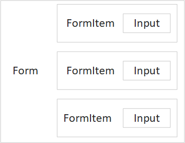
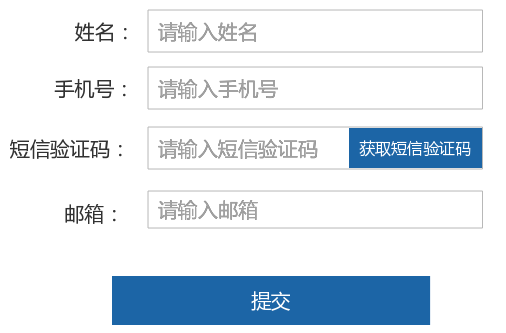
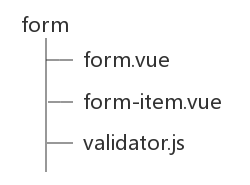
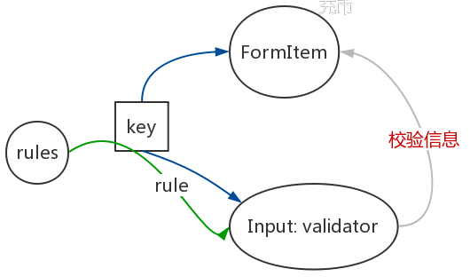

# 【step by step】使用 Vue 封装一个表单校验

## 一、前面的话

不管是` PC `端还是移动端，提交表单是一个常见场景，那么友好交互的表单校验也是一个常见场景了。

最近本人在开发移动端页面，也遇见了表单需求，倒霉的是技术选型中的` UI `库不符合业务场景，于是~~~~

我走上了一条自己动手，然后希望丰衣足食的道路.....


不过当我将思路想清楚之后，我发现实现过程比我想象得简单了很多!现在我来记录一下我的思路。


## 二、思路

### 交互设计

由于我们的产品经理没提表单交互要求（果然随便才是最难的），于是我就成了上帝，想怎么折腾就怎么折腾 ^ _ ^

于是我就根据经验和业务场景，设计了一下需求：

1. 可校验整个表单
2. 可校验表单的一部分
3. 重置表单并且清除校验结果
4. 在表单字段的值变化或者输入结束就校验（通俗点就是输入框值变化或者失焦时触发校验）

### 实现设计

根据业务场景，在实现表单校验的过程中，我封装了三个组件：` Form `、` FormItem `、` Input `，它的结构应该下面这样的：




下面是我对他们的功能分配：

#### 1. 表单组件——` Form `

` Form `组件重点不在` UI `，它的重点在于逻辑实现，比如实现校验（局部）表单，重置表单等这些功能。

之所以将这些功能放在` Form `组件中，是因为想和` UI `表单一致，将整个表单包装成一个整体。

而如果将这些功能放在` FormItem `组件中，就是将表单打散了。而且，如果校验整个表单或重置表单时，我们就需要操作一个一个` FormItem `，这样会让我们的代码很难读。

#### 2. 表单项组件——` FormItem `

表单项组件重点在` UI `，主要呈现表单项标签和校验信息

#### 3. 输入框

其实这里"输入框"指的是能和用户交互的部分，比如` select `、` input `、` radio `、` textArea `等。根据业务场景，我是对` input `进行了封装。

## 三、实现

先把场景摆出来~~~



上面的场景就包含两个校验需求：
1. 点击提交，校验整个表单
2. 点击获取短信验证码，需要校验是否输入了正确的手机号，这就是一个校验单个字段的业务场景。

现在开始一步一步实现表单校验。

现在我的目录结构是这样的：



开始时，我是这样写的：

```
<template>
  <div>
    <li-form ref="form">
      <li-form-item>
        <li-input></li-input>
      </li-form-item>
      <!-- 省略部分 -->
    </li-form>
  </div>
</template>
export default {
  name: 'app',
  data() {
    return {
      form: {
        name: '', // 姓名
        phone: '', // 手机号
        email: '',  // 邮箱,
        code: '' // 验证码
      }
    }
  },
  components: {
    [Form.name]: Form,
    [FormItem.name]: FormItem,
    [Input.name]: Input
  }
}
</script>
```

我们使用` form `来存储用户输入，但是现在的表单只是一个基本的结构，还不具备校验功能。

那么，实现表单校验的第一步是啥？？？

不知道你想到的第一步是什么，我想到的第一步是实现校验工具

### ` step 1 `：实现校验工具

校验工具是用来实现校验功能的

对于实现校验工具，我需要思考两个问题：

1. 校验工具的输入和输出
2. 定义校验规则

#### 1. 校验工具的输入和输出

校验工具通常是一个函数，那么这个函数就有会输入和输出。

校验工具是为了校验用户输入，那么它的输入(参数)就应该是用户的输入和校验规则，由于可以对用户的输入进行多个限制的校验，那么校验规则就应该是一个数组。

校验工具的输出应该是校验结果，校验结果可以是下面几种方式：

1. ` Promise.reject() / Promise.resolve() `: 用` Promise `方法来表示校验是否通过。
2. ` Boolean `值

我选择的是第二种方法。第一种方法的缺点是，在多个表单组合成一个大表单的时候，如果第一个表单校验不通过(` Promise.reject() `)会阻塞后面表单的校验，不符合业务场景。

#### 2. 定义校验规则

对于用户的输入，我们应该从什么角度规定用户的输入是合适的，比如是否是必填项，限制长度、最小长度、最大长度、类型（数字或字符串）等。有时我们还需要根据具体需求来动态校验。所以，我从下面几个角度来定义校验规则：

1. 是否必填
2. 输入长度
3. 最小(大)输入长度
4. 类型
5. 正则校验规则
6. 自定义校验


假设，我们现在对用户的姓名做这样的限制：必填，输入长度在` 1 - 10 `；如果用户没有输入，则提示"请输入姓名"；如果用户输入的字符超出了` 10 `个字符，则提示"请输入` 1 - 10 `个字符"

```js
// 表单：
const form = {
  name: '', // 姓名
  phone: '', // 手机号
  email: ''  // 邮箱
}
// 表单规则：
const rules = {
  name: [
    { required: true, message: '请输入姓名' },
    { min: 1, max: 10, message: '请输入1 - 10个字符'}
  ]
}
```

下面的方法是根据用户的输入，然后返回校验信息，注意：这里不是返回校验结果。

```js
// validator.js
/*
rules = [
  { required: true, message: '请输入姓名' },
  { min: 1, max: 10, message: '请输入1 - 10个字符'}
]
*/
export const validator = (value, rules) => {
  const result = [] // 保存校验信息
  rules.forEach(rule => {
    let msg = ''
    const {
      len = 0,          // 字段长度
      max = 0,          // 最大长度
      min = 0,          // 最小长度
      message = '',     // 校验文案
      pattern = '',     // 正则表达式校验
      type = 'string',  // 类型
      required = false, // 是否必填
      validator         // 自定义函数
    } = rule
    if (required && !value) {
      msg = message || '请输入'
    }
    // typeValidator: 校验类型
    if (type === 'string' && typeValidator(value) && value) {
      const length = String(value).length || 0
      // lengthValidator: 校验长度
      msg = lengthValidator(length, min, max, len, message)
    }
    if (pattern) {
      const isReg = typeValidator(pattern, 'RegExp')
      if (!isReg) {
        msg = '正则校验规则不正确'
      }
      if (!pattern.test(value)) {
        msg = message || '请输入正确的值'
      }
    }
    if (validator && typeof validator === 'function') {
      msg = validator(value, rules)
    }
    if (msg) {
      result.push(msg)
    }
  })
  return result
}
// typeValidator: 类型校验函数，比较粗糙~~~
const baseTypes = ['string', 'number', 'boolean']
const typeValidator = (value, type = 'string') => {
  if (baseTypes.includes(type)) {
    const valueType = typeof value
    return baseTypes.includes(valueType)
  } else if (type === 'array') {
    return Array.isArray(value)
  } else if (type === 'email') {
    const reg = /^[a-zA-Z0-9_.-]+@[a-zA-Z0-9-]+(\.[a-zA-Z0-9-]+)*\.[a-zA-Z0-9]{2,6}$/
    return reg.test(value)
  } else if (type === 'RegExp') {
    return value instanceof RegExp
  }
}
// lengthValidator: 长度校验函数
const lengthValidator = (length, min, max, len, message) => {
  if (len && len !== length) {
    return message || `请输入${len}个字符`
  }
  if (min && length < min) {
    return message || `至少输入${min}个字符`
  }
  if (max && length > max) {
    return message || `最多输入${max}个字符`
  }
  if (min && max && (length < min || length > max)) {
    return message || `请输入${min} ~ ${max}个字符`
  }
  return ''
}
```

如果用户没有输入时，上面的方式执行后，会返回数组：

```js
validator(form.name, rules.name)
// ['请输入姓名', '请输入 1 - 10 个字符']
```

### ` Step 2 `: 邮递员送信

在上一步中，我们调用` validator ` 方法就可以得到校验信息，而前面我们就有说，表单的校验是在` Form `组件里实现的，所以，我们在` Form `组件中调用` validator `就可以了，而调用` validator `需要拿到` form `和` rules `这两个值，我们可以通过` prop `的形式传递给` Form `组件。

所以，开始，` Form `组件是这样的：

```
<!-- form.vue -->
<template>
  <div>
    <slot></slot>
  </div>
</template>
<script>
import { validator } from './validator'
export default {
  name: 'li-form',
  props: {
    data: {
      type: Object,
      default: () => ({})
    },
    rules: {
      type: Object,
      default: () => ({})
    }
  },
  methods: {
    // 校验整个表单
    validateFields () {
      // ...
    },
  }
}
</script>
```

#### 1. 校验表单

` Form `组件里` validateFields `方法来校验整个表单，在这里我们就要根据校验信息来返回校验结果啦^ _ ^

实现校验整个表单需要思考下面两点：

1. 校验每个字段，获得每个字段的校验信息，然后根据校验信息，返回校验结果。
2. ` FormItem `显示校验信息

第一个问题我们已经实现了，只需每个字段调用` validator `就可以了：

```js
// form.vue
validateFields () {
  let hasError = false
  const ruleKeys = Object.keys(this.rules)
  ruleKeys.forEach(ruleKey => {
    const value = this.data[ruleKey]
    const keyResult = this.validateField(value, ruleKey)
    if (!hasError) {
      hasError = keyResult.length > 0
    }
  })
  return hasError
}
validateField (value, prop) {
  const rules = this.rules[prop]
  let keyResult = validator(value, rules)
  return keyResult
}
```

上面代码的逻辑如下图所示：


我们通过遍历每个字段(` key `)，将表单(` form `)和校验规则(` rules `)联系起来，这样就可以获取到每个字段的值(` value `)和对应的校验规则(` rule `)，最后调用校验工具函数就可以了

第二个问题` FormItem ` 显示校验信息，就好像邮递员送信一样，需要将特定的信送到特定的收信人手上，这里` Form `组件就是邮递员，所以现在我们就需要将信与收信人联系起来，将检验信息给` FormItem `，并显示出来

那么我们怎么将信与收信人联系起来呢？

回忆第一个问题，我们是通过遍历` key `得到了对应的校验信息，那我们同样可以将` key `和` FormItem `绑定起来，用` key `作为` FormItem `的唯一标识:

```
<template>
  <div>
    <li-form :data="form" :rules="rules" ref="form">
      <li-form-item prop="name">
        <li-input></li-input>
      </li-form-item>
    </li-form>
  </div>
</template>
export default {
  name: 'app',
  data() {
    return {
      form: {
        name: '', // 姓名
      },
      rules: {
        name: [
          { required: true, message: '请输入姓名' },
          { min: 1, max: 10, message: '请输入1 - 10个字符'}
        ]
      }
  }
}
</script>
```

如图所示，这样我们就将` FormItem `和检验信息绑定起来：


在这里，将` key `和` FormItem `绑定起来，具体是使用` ref `属性。给` FormItem `添加` ref `属性后，我们就可以拿到` FormItem `实例，并且可以操作` FormItem `的属性和方法。

所以，当我们得到校验信息后，就可以通过` ref `来操作` FormItem `实例，让它显示校验信息。

下面是对` FormItem `的封装：

```
<!-- form-item.vue -->
<template>
  <div :ref="prop">
    <div>
      <slot name="label">
        <span>{{ label }}</span>
      </slot>
    </div>
    <div>
      <slot></slot>
      <span>{{ msg }}</span>
    </div>
  </div>
</template>
<script>
export default {
  name: 'li-form-item',
  props: {
    prop: {
      type: String,
      default: ''
    },
  },
  data () {
    return {
      error: [] // 校验信息:['请输入姓名', '请输入 1 - 10 个字符']
    }
  },
  computed: {
    msg () {
      return this.error[0] // 显示第一个
    }
  }
}
</script>
```

` FormItem `校验信息具体是什么结构，这个就看个人决定了

现在我们再回过头来改写` validateFields `

```js
// form.vue
validateFields () {
  // ...
  const ruleKeys = Object.keys(this.rules)
  ruleKeys.forEach(ruleKey => {
    const value = this.data[ruleKey]
    const keyResult = this.validateField(value, ruleKey)
    // ...
  }
  // ...
},
validateField (value, prop) {
  const [vNode] = this.$children.filter(vnode => prop in vnode.$refs)
  const rules = this.rules[prop]
  let keyResult = []
  if (vNode && rules) {
    keyResult = validator(value, rules)
    vNode.error = keyResult
  }
  return keyResult
}
```

在页面点击提交的时候，我们只写下面的代码就可以实现整个表单的校验啦！

```
this.$refs.form.validateFields()
```
到这里我们就实现了校验整个表单

而且细心的同学可能就会发现其实` validateField `方法就是校验某个字段的方法。

` validateField `方法通过` key ` 来得到` FormItem `实例，并且得到来校验信息，但是它返回的是校验信息，是一个数组。在这里，我为了和` validateFields `返回结构保持一致，所以我还另外写了一个方法用来校验某个字段

```js
// form.vue

// 校验表单字段
// @params value 表单字段值
// @params label 表单字段名称
validateFieldValue (value, lable) {
  let hasError = false
  const keyResult = this.validateField(value, lable)
  hasError = keyResult.length > 0
  return hasError
}
```
> 这里 validateFieldValue 只能校验一个字段，它完整的功能应该是可以校验多个字段，但是我没有这个业务场景，所以就没写，后面再完善这里。

所以在页面里点击获取短信验证码按钮时，写上：

```
this.$refs.form.validateFieldValue(this.form.phone, 'phone')
```

这就可以校验单个字段了。

#### 2. 重置表单

重置表单实现两个功能：
1. 将表单值清空
2. 移除校验结果

将表单值清空就需要将` props `传过来的` form `清空，这就是和父组件通信

移除校验结果和校验整个表单类似，只是不需要执行校验工具函数(` validator `)而已

所以，重置表单：

```js
// form.vue
// 重置表单
resetFields () {
  let obj = {}
  Object.keys(this.data).forEach(key => {
    obj = {
      ...obj,
      [key]: null
    }
  })
  this.validateFields(true)
  this.$emit('change', obj)
},
// 校验整个表单
validateFields (reset = false) {
  // ...
  const ruleKeys = Object.keys(this.rules)
  ruleKeys.forEach(ruleKey => {
    const value = this.data[ruleKey]
    const keyResult = this.validateField(value, ruleKey, reset)
  }
  // ...
},
validateField (value, prop, reset = false) {
  // ...
  let keyResult = []
  if (vNode && rules) {
    if (!reset) {
      keyResult = validator(value, rules)
    }
    vNode.error = keyResult
  }
  return keyResult
},
```

### ` Step 3 `: 寄信

表单校验功能基本完成了，但是还有一个校验功能没实现，就是在输入框值变化或者失焦的时候出发校验，所以先让我们来改写一下校验规则：

```js
rules: {
  name: [
    { required: true, message: '请输入姓名', trigger: 'blur' },
    { min: 1, max: 10, message: '请输入1 - 10个字符', , trigger: 'change' }
  ]
}
```

其中` trigger `就表示校验是在失焦还是值变化时触发校验。

那怎么实现呢～～

这里有两种思路：

1. 在` Input `组件内部再写一个校验方法
2. 触发` Form `组件的方法

第一种思路实现的核心还是` key `：
1. 根据` key `，首先得到该字段的校验规则
2. 在` Input `组件里调用` validator `方法得到校验信息
3. 操作父组件实例或使用事件，让` FormItem `显示校验信息

思路如下所示



但是这个方法也有问题：
1. 校验可能会执行多次，比如在最后一个输入框输完后，点击提交，这会出发` Form `的整体校验和` Input `的失焦校验。
2. ` Input `作为一个输入` UI `，没必要具备逻辑功能，这使得` Input `和父组件、` FormItem `组件的耦合性太高了
3. 最后，最重要的一点，作为一个深度懒癌患者，我不想将同样的代码，具备同样的功能的代码写在两个地方写两遍。

结果一想，这是让` Input `和` Form `通信啊，如果采用事件，那必须得在父组件里监听` Input `的` blur `或者` change `事件，这样灵活性太低了。

所以最后，我采用的是第二个方法——触发` Form `组件的方法

实现第二种方法，我们需要解决两个问题：
1. 在` Input `能拿到` Form `组件的实例
2. 因为是调用` validateFieldValue (value, lable) ` 方法，所以我们还需要知道字段` key `

这个过程就好像我们把信写好了，需要去邮局去寄信一样。

所以现在的问题是我们怎么知道邮局在哪呢？


在又双叒叕看了` Vue `的` API `后，突然灵光一现，发现`  Provide / inject `可以解决我的问题

> 这对选项需要一起使用，以允许一个祖先组件向其所有子孙后代注入一个依赖，不论组件层次有多深，并在起上下游关系成立的时间里始终生效。

` Provide `可以向子孙后代注入依赖，那我们将` Form `实例注入` Input `就可以啦，另外字段` key `值我们也可以使用` Provide ` ^ _ ^

现在我们先在` Form `组件里使用` Provide `来向子孙后代注入实例。

```
// form.vue
export default {
  provide () {
    return {
      liForm: this
    }
  }
}
```
然后在` FormItem `组件里使用` Provide `向子孙注入` key `：

```
// form-item.vue
export default {
  props: {
    prop: {
      type: String,
      default: ''
    }
  }
  provide () {
    return {
      formItem: this.prop
    }
  }
}
```
最后我们在` Input `里使用` inject `来接收依赖：

```
<!-- input.vue -->
<template>
  <div>
    <input
      :value="value"
      @blur="$blur"
      @change="$change"
      @input="$input"
    >
  </div>
</template>
<script>
export default {
  name: 'li-input',
  model: {
    prop: 'value',
    event: 'change'
  },
  inject: {
    liForm: {
      default: ''
    },
    formItem: {
      default: ''
    }
  },
  props: {
    value: [String, Number]
  },
  methods: {
    $blur (e) {
      this.$emit('blur', e)
      const value = e.target.value
      this.triggerValidate(value, 'blur')
    },
    $change (e) {
      const value = e.target.value
      this.$emit('change', value)
    },
    $input (e) {
      const value = e.target.value
      this.$emit('input', value)
      this.$emit('change', value)
      this.triggerValidate(value, 'change')
    },
    triggerValidate (value, triggerTime) {
      if (!(this.liForm && this.formItem)) return
      const trigger = this.liForm.getTriggerTimer(this.formItem, triggerTime)
      if (trigger === triggerTime) {
        this.liForm.validateField(value, this.formItem)
      }
    }
  }
}
</script>
```
> **Note**:在` inject `里给` liForm `和` formItem `添加一个默认值(` default `)，否则会报错


` liForm.getTriggerTimer `是为了获取字段校验规则里面定义的校验时机：

```js
// form.vue
getTriggerTimer (lable, triggerTime) {
  const rules = this.rules[lable]
  const ruleItem = rules.find(item => item.trigger === triggerTime)
  const { trigger = '' } = ruleItem || {}
  return trigger
}
```

到这里，表单校验基本完成啦^ _ ^


## 最后

开始是打算附上源码，并写个` Demo `，可是目前没时间啊，后面会加上。而且这代码写的比较粗糙，也需要完善，不过我写这文章是为了记录我的思路，然后希望让看到这篇文章的你引起思考，让我们能有一个思想上的碰撞。

下面来总结一下：


1. ` Form `组件实现校验功能，` FormItem `显示校验信息，` Input `用于用户输入。
2. 通过每个字段的` key `值将` Form `、` FormItem `和` Input `组件联系在一起。通过` key `值，` Form `操作` FormItem `实例，让` FormItem `显示校验信息。
3. 通过` Provide/inject `和` key `值，让` Input `操作` Form `组件，实现失焦或值变化校验。
