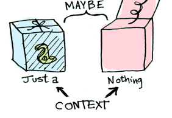
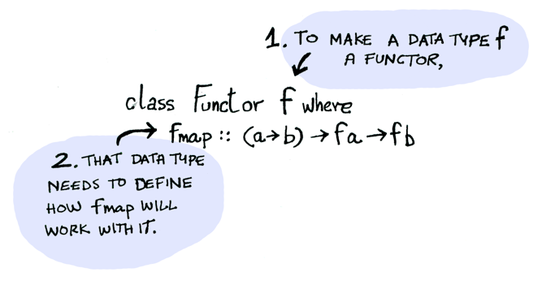
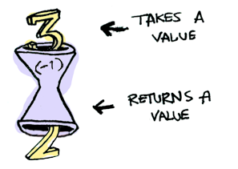
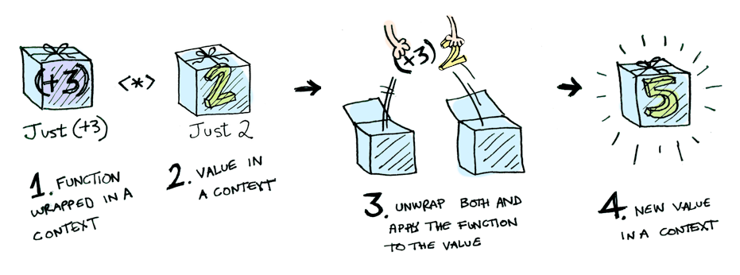
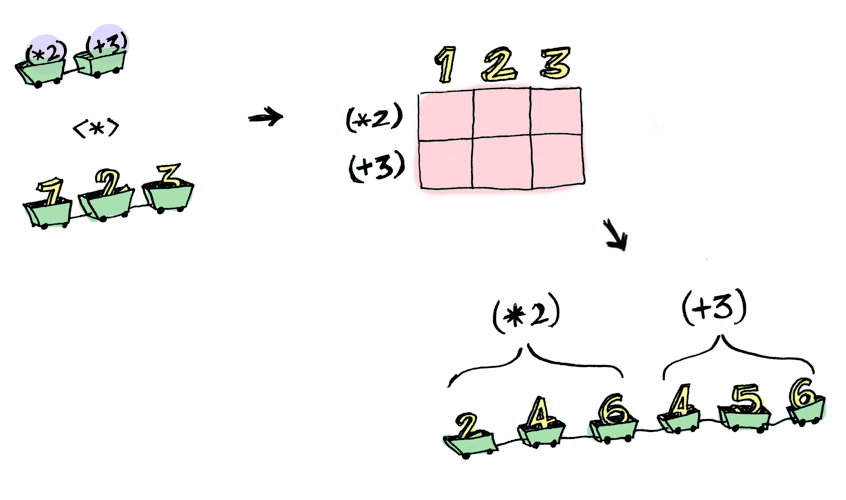
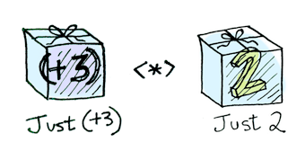

## 图解` Functor `, ` Applicative `和` Monad `
> 1. [英文原文链接](http://adit.io/posts/2013-04-17-functors,_applicatives,_and_monads_in_pictures.html)
>
> 2. 原文是站在` Haskell `方面写的，其中涉及到一些` Haskell ` 中的方法。这些方法对于` JavaScript `开发者可能不太容易理解，所以可以去看[` JavaScript `版本](https://medium.com/@tzehsiang/javascript-functor-applicative-monads-in-pictures-b567c6415221)
> 3. 上面的链接都需要梯子，想要看国内的文章，可以去[这里](http://www.ruanyifeng.com/blog/2015/07/monad.html)

下面是一个值：


我们都知道怎么运用一个函数到这个值上面：


> 备注：图中` (+3) `表示的是一个进行加` 3 `操作的函数

很简单。让我们扩展一下，==任何值都可以被放入一个上下文中==。所以现在你可以将上下文想象成一个盒子，你可以将一个值放进这个盒子中。


现在当你在这个值上使用函数时，根据不同的上下文，你会得到不同的结果，这就是` Functor `、` Applicative `、` Monad `和` Arrow `等的基础概念。如图：数据类型 ` Maybe `定义了两个相关的上下文。

> 数据类型就是对值的一种封装，不仅包括值本身，还包括相关的属性和方法。上图就是2的封装，从此2就不是一个单纯的值，而是一种数据类型的实例，只能在数据类型的场景（context）中使用。



```
data Maybe a = Nothing | Just a
```

很快我们会看到对一个` Just a `和一个` Nothing `来说函数应用有什么不同. 首先我们来说` Functor `（函子）

### ` Functor `

当一个值被封装在一个上下文里, 你就不能拿普通函数来应用:


这时，` fmap `出现了，` fmap ` 知道怎样将一个函数应用到一个带有上下文的值，举个例子，也许你想将` (+3) `运用到` Just 2 `上面，使用` fmap `：

```
> fmap (+3) (Just 2)
Just 5
```


` fmap `让我们知道它怎么做到的，但是` fmap `怎么知道怎么将函数运用到这个值上？

#### ` Functor `是什么？这又是正确的吗？

` Functor `是一种[` typeclass ` ](http://learnyouahaskell.com/types-and-typeclasses#typeclasses-101)，下面是它的定义：



> ` typeclass `是一类定义了一些行为的接口。如果一种数据类型是` typeclass `，那么这种数据类型就支持和执行在` typeclass `中描述的行为。

一个` Functor `是定义了` fmap `的工作原理的任何数据类型，下面就描述了` fmap `怎么工作的：


所以我们可以这样做：

```
> fmap (+3) (Just 2)
Just 5
```

` fmap `神奇地运用了这个函数。因为` Maybe `是一个 ` Functor `，它申明了` fmap `怎么运用到` Just `和` Nothing `：

```
instance Functor Maybe where
    fmap func (Just val) = Just (func val)
    fmap func Nothing = Nothing
```

当我们写下` fmap (+3) (Just 2) `时，它正发生着下面的事情：


所以接下来你很喜欢已有的` fmap `，但是当你运用` (+3) `到` Nothing `上呢？


```
> fmap (+3) Nothing
Nothing
```

另一个例子，当你运用一个函数到一个` list `上面会发生什么呢？


` Lists `也是` functor `，下面是它的定义：

```
instance Functor [] where
    fmap = map
```

最后一个例子：当你将一个函数运用到另一个函数上回发生什么呢？

```
fmap (+3) (+1)
```

下面是一个函数



下面是一个函数应用到另一个函数上面：


结果也是另外一个函数：

```
> import Control.Applicative
> let foo = fmap (+3) (+2)
> foo 10
15
```

所以函数也是` Functor `。

```
instance Functor ((->) r) where
    fmap f g = f . g
```

当你在一个函数上使用` fmap `时，其实你就是在做函数合成

注意: 目前为止我们做的是将上下文当作是一个容纳值的盒子. 特别要记住: 盒子是有效的记忆图像, 然而有时你并没有盒子. 有时你的 “` 盒子 `” 是个函数.

### ` Applicative `

` Applicative `把它带到了一个新的层次。使用` Applicative `，我们的值放在上下文中，就像` Functor `：


而且我们的函数也可以放入上下文中：


完全理解` Applicative `并不是开玩笑，` Control.Applicative `定义了` <*> `, 这个函数知道怎样把封装在上下文里的函数应用到封装在上下文里的值上面:



也就是

```
Just (+3) <*> Just 2 == Just 5
```

使用` <*> `能带来一些有趣的情形. 比如:

```
> [(*2), (+3)] <*> [1, 2, 3]
[2, 4, 6, 4, 5, 6]
```



这里有一些是你能用` Applicative `做, 而无法用` Functor `做到的. 你怎么才能把需要两个参数的函数应用到两个封装的值上呢?

```
> (+) <$> (Just 5)
Just (+5)
> Just (+5) <$> (Just 4)
ERROR ??? WHAT DOES THIS EVEN MEAN WHY IS THE FUNCTION WRAPPED IN A JUST
```

` Applicatives `:

```
> (+) <$> (Just 5)
Just (+5)
> Just (+5) <*> (Just 3)
Just 8
```

` Applicative `把` Functor `推到了一边. “大腕儿用得起任意个参数的函数,” 他说. “用` <$> `和` <*> `武装之后, 我可以接受需要任意个未封装的值的函数. 然后我传进一些封装过的值, 再我就得到一个封装的值的输出!”

```
> (*) <$> Just 5 <*> Just 3
Just 15
```

一个叫做` liftA2 `的函数也做一样的事:

```
> liftA2 (*) (Just 5) (Just 3)
Just 15
```

### ` Monad `

怎么学习` Monad `：

1. 获得计算机科学的` PhD `
2. 把它扔在一边，因为在这个章节里，你不会需要它

` Monad `更加麻烦了

` Functor `应用函数到封装过的值:


` Applicative `运用封装过的函数到封装过的值上面：



` Monad `运用一个返回封装过的值的函数到一个封装过的值上，` Monad `有一个函数` >>= `（发音"` bind `"）来做这件事。

让我们来看一个例子，熟悉的` Maybe `是一个` monad `：


假设` half `是仅仅对偶数才可用的函数：

```
half x = if even x
           then Just (x `div` 2)
           else Nothing
```


如果我们传给它一个封装过的值会发生什么？


我们需要使用` >>= `将封装过的值挤进这个函数，下面是` >>= `的图片：


它怎么起作用的:

```
> Just 3 >>= half
Nothing
> Just 4 >>= half
Just 2
> Nothing >>= half
Nothing
```

在内部发生了什么？` Monad `是另外一种` typeclass `，下面是它的部分定义：

```
class Monad m where
    (>>=) :: m a -> (a -> m b) -> m b
```

下图说明了` >>= `是什么？


所以` Maybe `是一个` Monad `：

```
instance Monad Maybe where
    Nothing >>= func = Nothing
    Just val >>= func  = func val
```

下图就是` Monad `对` Just 3 `发生了什么：


如果你传给它一个` Nothing `，那就更简单了：


你也可以级联这个函数：

```
> Just 20 >>= half >>= half >>= half
Nothing
```


所以现在我们知道了` Maybe `同时是一个` Functor `、` Applicative `和` Monad `。现在让我们开始另一个示例： ` the IO monad `


` 3 `个特别的函数。` getLine `获取用户输入而不接收参数:


```
getLine :: IO String
```

` readFile `需要一个字符串（文件名）参数，返回这个文件的内容：


```
readFile :: FilePath -> IO String
```

` putStrLn `需要一个字符串参数，并且将它打印出来


```
putStrLn :: String -> IO ()
```

这三个函数都接收一个常规的值 (或者不接收值) 返回一个封装过的值. 我们可以用` >>= `把一切串联起来!


```
getLine >>= readFile >>= putStrLn
```

### 总结：

1. 一个` functor `是一种数据类型，它需要执行` Functor typecla `描述的行为
2. 一个` applicative  `是一种数据类型，它需要执行` Applicative typeclass ` 描述的行为
3. 一个` monad  `是一种数据类型，它需要执行` Monad typecla `描述的行为
4. 一个` Maybe `遵守这个，所以它既是` functor、applicative `，也是` monad `

` functor `、` applicative `和` monad `之间有什么不同？


- ==` functors `==：你可以使用` fmap `或` <$> `将一个函数运用到一个封装的值上
- ==` applicatives `==：你可以使用` <*> `或` liftA ` 将一个封装过的函数运用到一个封装的值上
- ==` monads `==：你可以使用` >>= `或` liftM ` 将一个返回封装值的函数运用到一个封装的值上


### 参考资料

[` Functors, Applicatives, And Monads In Pictures `](http://adit.io/posts/2013-04-17-functors,_applicatives,_and_monads_in_pictures.html)

[` A Fistful of Monads `](http://learnyouahaskell.com/a-fistful-of-monads)

[` Javascript Functor, Applicative, Monads in pictures `](https://medium.com/@tzehsiang/javascript-functor-applicative-monads-in-pictures-b567c6415221)
